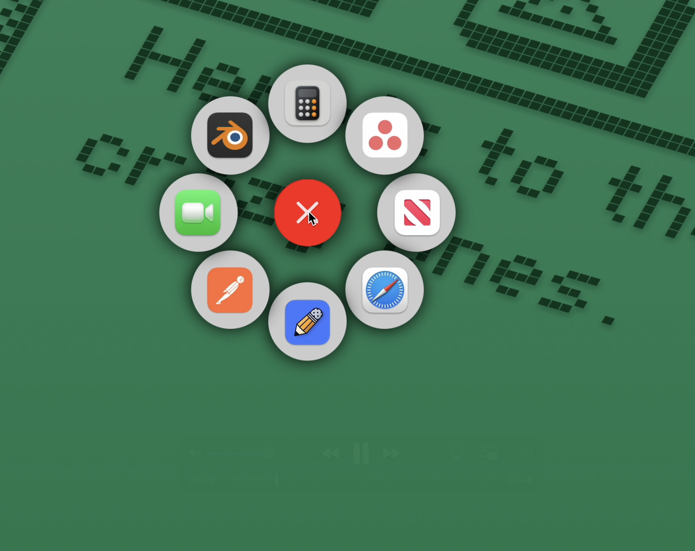
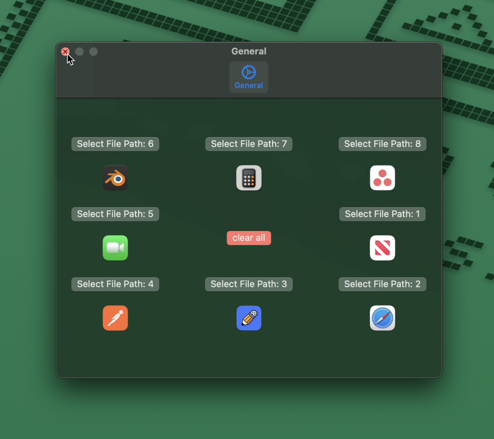

# 🎯 RadialMenu

A customizable radial (pie-style) menu designed to help macOS users quickly switch between applications using an intuitive and visually appealing interface.

https://github.com/user-attachments/assets/8e780401-7822-4630-850a-d79105e8778b

---

## 🧭 Overview

**RadialMenu** enhances macOS navigation by providing a fast, gesture-friendly way to launch or switch between apps. Inspired by radial menus found in games and creative software, this tool aims to boost productivity while offering a clean, minimal UI.

#### Shortcut Keys:
Hold down: (**Option ⌥** + **Command ⌘**) to open up the menu
---

## ✨ Features

- **Radial UI** – Interactive pie-style menu for fast visual navigation  
- **App Shortcuts** – Quickly launch or switch between favorite apps  
- **Customizable Layout** – Modify icons, order, and assigned applications  
- **macOS Native** – Designed specifically for macOS with native APIs  

---

## 🛠️ Built With

- **Swift** – Core application logic  
- **SwiftUI / AppKit** – User interface components and system integration  
- **macOS APIs** – For application control and menu customization

---

## 📸 Screenshots

  

  

---

## 🚀 Future Ideas

- Support for custom actions or AppleScript integration  
- Keyboard + mouse hybrid navigation  
- Theming and visual customization  
- Quick access to system settings or folders  

---

## 🧪 Status

This is a personal project created for experimentation and workflow improvement. Still evolving and open to new features.

---

## 📄 License

Open source / personal use — feel free to explore or adapt with credit.

---
